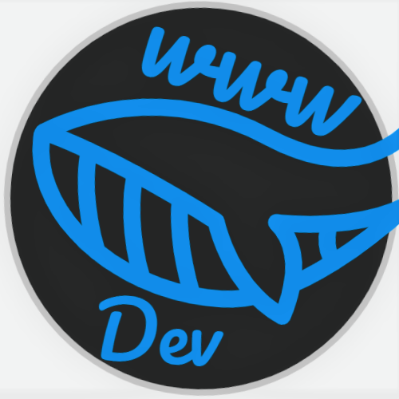

# Hello! 👋
Hi, my name is **Whale Well Well** and I am 14 years old! I am a self taught Jr. developer, and have taken many online courses on **Edx**, **Codecadamy**, **The Odin Project**, **Github**, and **Pluralsight**. Over the past couple years, I have learned many programming languages, including: 

- ```Html``` ( Also ```PUG``` )
- ```Css``` ( And ```SASS``` )
- ```JavaScript```
- ```Python``` ( and some of ```Pygame``` too! )
- ```C++``` (```C#```)
- ```Shell``` ( ```Bash``` )
- I also know how to use ```JQuery``` and ```Bootstrap```.

<hr>

<hr>

# Contact:
You can find me on several sites, including:

-  [Github]()
- [Codepen](https://codepen.io/WhaleWellWell)
- [Stack Overflow](https://stackoverflow.com/users/18981665/whalewellwell)
- [WebDeveloper.com](https://webdeveloper.com/@WhaleWellWell/)

# Stats:
```Python
print("Stats:")
```
<hr>

[](https://github.com/WhaleWellWell/github-readme-stats)

<hr>

I hope to use ```Js``` more 😞...
